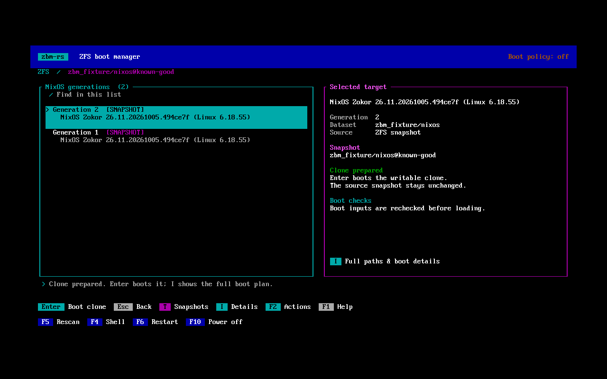
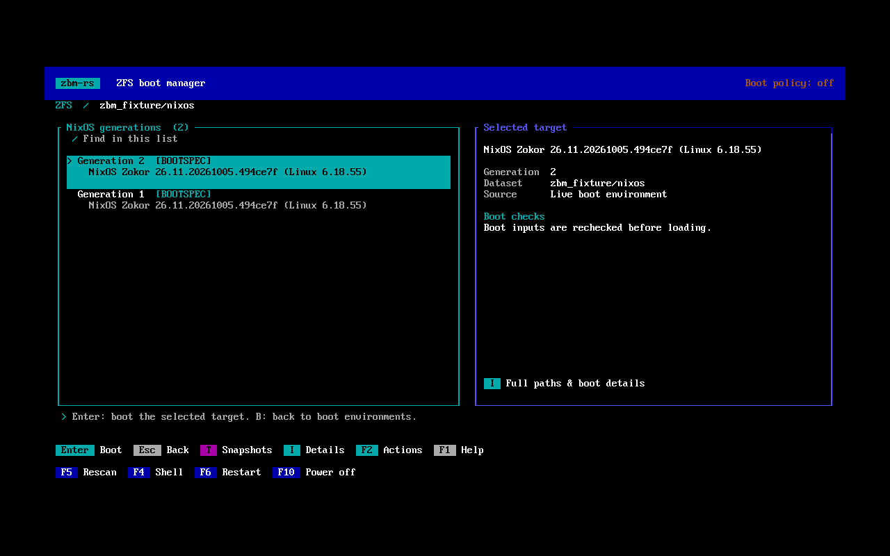
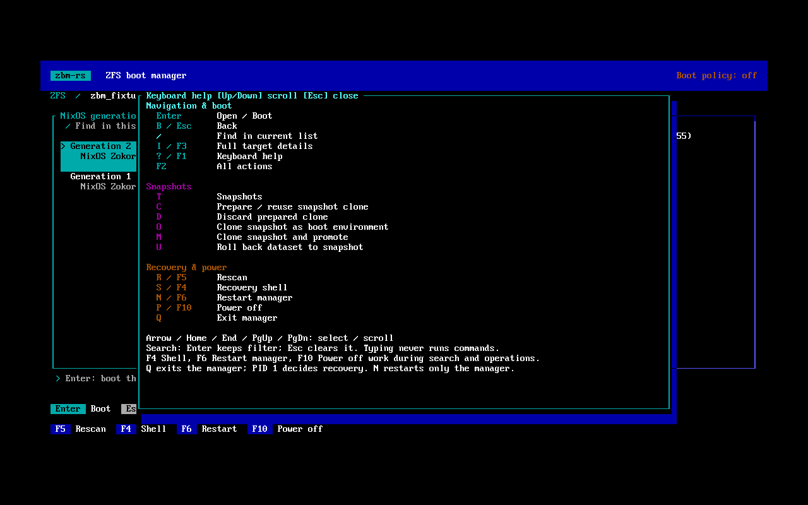

<h1 align="center">zbm-rs</h1>

> A Rust ZFS boot manager with Secure Boot, native NixOS generations and snapshot boot.

[](https://github.com/okhsunrog/zbm-rs/actions/workflows/check.yml) [](#license) [](docs/roadmap.md)

<p align="center">
  <a href="docs/screenshots/snapshot.png">
    
  </a>
</p>

<p align="center"><sub>NixOS snapshot selection and the prepared clone's boot summary, captured in a disposable QEMU VM.</sub></p>

---

> [!NOTE]
> Enforced NixOS root and snapshot-clone boot have passed OVMF Secure Boot tests.
> Physical Secure Boot acceptance, generic-Linux verified boot and interactive
> encrypted-root unlock are still pending. Default images are unsigned and use
> `security.mode = "off"`. See [tested scope](docs/verification.md).

## Overview

zbm-rs starts a small Linux environment, discovers boot targets on ZFS and hands
control to the selected OS through kexec. Browse ordinary Linux kernels, NixOS
Bootspec generations and snapshots from one keyboard-driven interface.

- **Secure Boot and verified boot.** Enforced images authorize the exact kernel,
  initramfs, arguments and permitted ZFS root before handoff. Trusted snapshot
  clones follow the same policy.
- **Native NixOS generations.** Select the generation's system closure directly
  from Bootspec, including generations that share a kernel.
- **Writable snapshot boot.** Prepare an owned clone without rolling back the
  source dataset. Ordinary mode also supports confirmed rollback, persistent
  clones and promotion.
- **TPM2 measured boot.** Optionally record the verified prepared target and its
  final arguments in PCR15. The selected OS owns SRK/NvPCR setup.
- **Declarative Nix images.** Build the loader kernel, matching ZFS, userspace,
  configuration and public trust inputs together.
- **Supervised recovery.** A separate PID 1 restores the console after manager
  failure. Enforced mode keeps recovery within the verification policy.

### Screenshots

| NixOS generations | Keyboard help |
| :---: | :---: |
| <a href="docs/screenshots/generations.png"></a> | <a href="docs/screenshots/keyboard-help.png"></a> |

All three screenshots show the real interface in an ordinary-mode disposable VM.
See [their setup and reproduction steps](docs/screenshots/README.md).

## Secure Boot

Firmware verifies the signed loader image. The enforced loader then checks the
selected OS boot inputs as one owner-authorized combination: the kernel signature,
initramfs IMA signature, exact arguments and allowed root selection.

The interface runs without root privileges; a privileged broker resolves and
verifies inputs before loading them. Protected recovery offers diagnostics,
restart, reboot and poweroff. Disabling firmware Secure Boot does not disable an
enforced image's target checks.

Public certificates belong in the image. Owner signing keys stay outside Nix and
image outputs. This verifies boot inputs; it does not authenticate every file in
the selected root or prevent rollback. Read the [trust-chain design](docs/secure-boot-model.md)
and [signing workflow](docs/security-testing.md).

## TPM

An enabled TPM policy measures the verified prepared boot plan in PCR15 after
successful input loading. The event records preparation, not successful OS
execution. SRK/NvPCR setup and OS phase measurements belong to the selected OS.
Disk unlock, remote attestation, rollback resistance and PCR15 log transport into
the selected OS are not implemented. See [TPM ownership and evidence](docs/tpm.md).

## Relationship to ZFSBootMenu

[ZFSBootMenu](https://docs.zfsbootmenu.org/en/latest/) established the Linux/initramfs
and kexec model used here. zbm-rs preserves familiar dataset properties and uses
[zfskit](https://github.com/okhsunrog/zfskit) for ZFS operations. Its focus is
integrated boot-input authorization, native NixOS generations and explicit
supervisor, manager and broker roles.

ZFSBootMenu already supports EFI signing, snapshot management and QEMU testing.
Its encryption, recovery and distribution support are broader today. zbm-rs is
an independent implementation with [specific supported layouts](docs/usage.md#supported-layouts)
rather than full feature parity.

## Quick start

Build the unsigned EFI image on an x86_64 Linux host with Nix and flakes enabled:

```sh
nix build .#zbm-rs-efi
```

The output includes `result/esp/EFI/BOOT/BOOTX64.EFI`, the loader kernel, initramfs
and a build manifest. The NixOS module exposes an image without replacing your
existing bootloader. Configuration changes rebuild the image; enforced deployments
use the separate owner signing workflow.

For a disposable QEMU session:

```sh
nix build .#zbm-rs-efi-test --out-link result-test
cargo xtask vm --run target/vm/demo-001 boot --image result-test
```

The test profile includes SSH and harness controls. Use fresh run directories and
disposable guest disks; keep it out of normal deployments. Follow [the build guide](docs/build.md)
for profiles and NixOS integration, or [the development guide](docs/development.md)
for fixtures and VM controls.

## Documentation

- [Secure Boot design](docs/secure-boot-model.md) and [owner signing](docs/security-testing.md)
- [TPM measurements](docs/tpm.md)
- [Boot environments, snapshots and controls](docs/usage.md)
- [Building](docs/build.md) and [configuration](docs/configuration.md)
- [Architecture](docs/architecture.md) and [development](docs/development.md)
- [Verification](docs/verification.md) and [roadmap](docs/roadmap.md)

Research and historical test records are linked from [the documentation index](docs/index.md).

## License

Licensed under either [MIT](LICENSE-MIT) or [Apache 2.0](LICENSE-APACHE), at your option.
